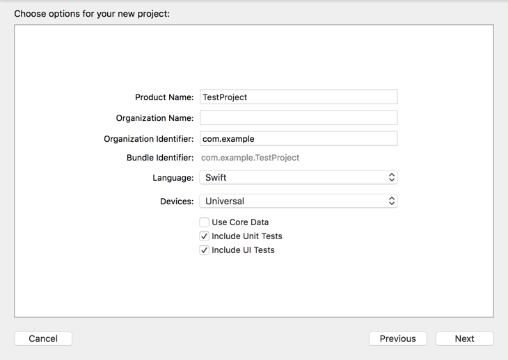
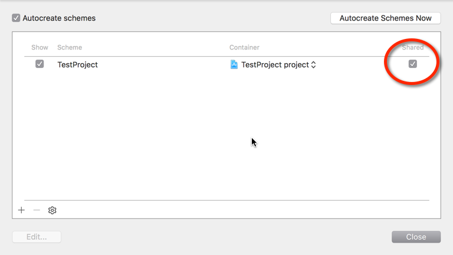

Are you an iOS developer? Do you use GitLab? Are you super jealous of your web-developing colleagues getting to use fancy build tools like [GitLab CI][0]? If so, than this writeup is for you!

OK, now that the cheesy intro is out of the way, let's get started.

### 0. Requirements

- GitLab 8.0 with CI configured ([instructions][1])
- Mac OS X El Capitan
- Xcode 7.0.1
- iOS 9

My setup instructions assume you have GitLab 8.0, because they've bundled CI into the main site. You can probably get previous versions working, but you'll have to find your own way through the setup &amp; UI.

I am using the latest versions of Apple's software, but I would imagine these instructions will work with the preceding version for each.

### 1. Install GitLab CI Multi-Runner

The runner is the process that will actually execute the shell commands that you are sending to it. Generally, the runner would exist on a machine/server that is dedicated to the purpose. The runner is usually installed on a machine separate from the GitLab server.

Most projects that will be integrated with GitLab CI can use a runner installed on any type machine (Linux, Mac, Windows, etc). Unfortunately, being iOS developers, our runner has to run on a Mac, since that's the only environment that supports Xcode and the Xcode command line tools.

For demonstration &amp; testing purposes, I have installed my runner on my local MacBook Pro, since I'll be the only one using it. In a production environment, I would set up (or [rent][3]) a dedicated Mac Mini or similar device to serve as the runner.

You should follow [GitLab's installation docs][4] to get the runner installed.

### 1a. Add `ios` Tag to Runner (optional)

My colleagues mostly consist of web developers, so I want to make sure that my Mac OS X runner (my laptop) won't be running the CI jobs for their JavaScript projects. To accomplish this, I make use of GitLab CI's tagging system.

1. Navigate to your GitLab server in your browser
2. Click the **Admin Area** icon in the upper right
3. Click **Continuous Integration** in the left sidebar
4. Click **Runners** in the left sidebar
5. Find your runner in the list, and click the **Edit** button
6. Add `ios` to the **Tags** field
7. Click the **Save** button

### 2. Project Setup

I am going to assume that you have a repository created on your GitLab instance, and you have committed &amp; push an iOS project to that repository. If you'd like to start from scratch, that might be easiest. I have created a blank iOS project.

### 3. Add Project to GitLab CI

1. Navigate to your GitLab server in your browser
2. Click **Continuous Integration** in the left sidebar
3. Find your project in the list and click **Add project to CI**
4. Click the **Runners** in the left sidebar
5. Click the **Enable shared runners** button

### 4. Share Your Scheme

1. Open your project in Xcode
2. In the menu bar, click **Product > Scheme > Manage Schemes...**
3. Find the scheme for your project's main target and make sure the **Shared** checkbox is checked
4. Close the dialog window
5. Add the new xcscheme file to your repository

### 5. Install xcpretty

When Xcode dumps it's output to the console, it is in a format which isn't easily human-readable. xcpretty is a utility that will transform Xcode's output into a format that is easy to understand and browse quickly.

Follow [their installation docs][5] to get xcpretty onto your system.

### 6. Create GitLab CI Config File

1. Open [your favorite editor][2] and create a file called `.gitlab-ci.yml`.
2. Paste the contents of the below snippet into your editor and save the file
3. Add the file to your repository
4. Commit your changes and push your repo to GitLab

### 7. See if it worked!

1. Navigate to your GitLab server in your browser
2. Click **Continuous Integration** in the left sidebar
3. Find your project in the list and click it
4. Click the commit id of the top row to see the build information
5. Click the build id of the top row to see the build output

### 8. Configure Provisioning

At this point, you probably have a working CI process, but your builds are failing due to a provisioning error. You will have to modify the build script to include references to your team &amp; provisioning profile.

Check out the following for more info on the [xcodebuild arguments][7].

## What next?

When learning something new, I like to make subtle changes to see how/if things break. Here are some suggestions to aid in your learning on this topic.

- try removing xcpretty and see what it looks like
- try un-sharing your Xcode project scheme and see what happens
- check out [xcpretty's options][5] and tweak the output
- check out the different flags for [GitLab CI's YAML config file][6]

There are lots of different possibilities with GitLab CI. Some topics I may explore in the future include:

- static analysis &amp; linting
- adding a test phase for unit &amp; UI tests
- continuous deployment

  [0]: https://about.gitlab.com/gitlab-ci/
  [1]: https://about.gitlab.com/downloads/
  [2]: https://xkcd.com/378/
  [3]: https://macstadium.com
  [4]: https://gitlab.com/gitlab-org/gitlab-ci-multi-runner/blob/master/docs/install/osx.md
  [5]: https://github.com/supermarin/xcpretty
  [6]: http://doc.gitlab.com/ci/yaml/README.html
  [7]: https://coderwall.com/p/rv2lgw/use-xcodebuild-to-build-workspace-vs-project
